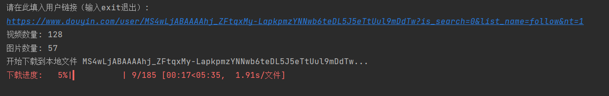

# douyin_crawl

### 简介
```text
一个简洁的抖音作品批量下载命令行工具
```
### 开发环境
```text
windows10
pycharm
```

### 编译运行环境
```text
Python 3.8.6 (tags/v3.8.6:db45529, Sep 23 2020, 15:52:53) [MSC v.1927 64 bit (AMD64)] on win32
Type "help", "copyright", "credits" or "license" for more information.
```

### 使用说明

```text
需要安装以下Python库

pip install PyExecJS (Python调用JavaScript)
pip install requests  (同步http客户端)
pip install tqdm (进度条工具)
pip install browser-cookie3 (爬取浏览器Cookie工具)
pip install loguru (Python日志工具)


get_cookie_from_chrome.py用于获取cookie,crawl_home.py是爬取主程序
python get_cookie_from_chrome.py
python crawl_home.py 
```

```text
用户主页链接粘贴示例(支持模糊),以下两种链接均支持

1.分享格式
长按复制此条消息，打开抖音搜索，查看TA的更多作品。 https://v.douyin.com/iJLb8V4y/

2.电脑端的浏览器url
https://www.douyin.com/user/MS4wLjABAAAAK8yyhMzdNAtyWqupVvVBXB_4bmr6DMAZ0zpGn91qlJU?vid=7124859220079561995
https://www.douyin.com/user/MS4wLjABAAAAK8yyhMzdNAtyWqupVvVBXB_4bmr6DMAZ0zpGn91qlJU
```

## 运行截图



其他疑问请加qq1406823510
